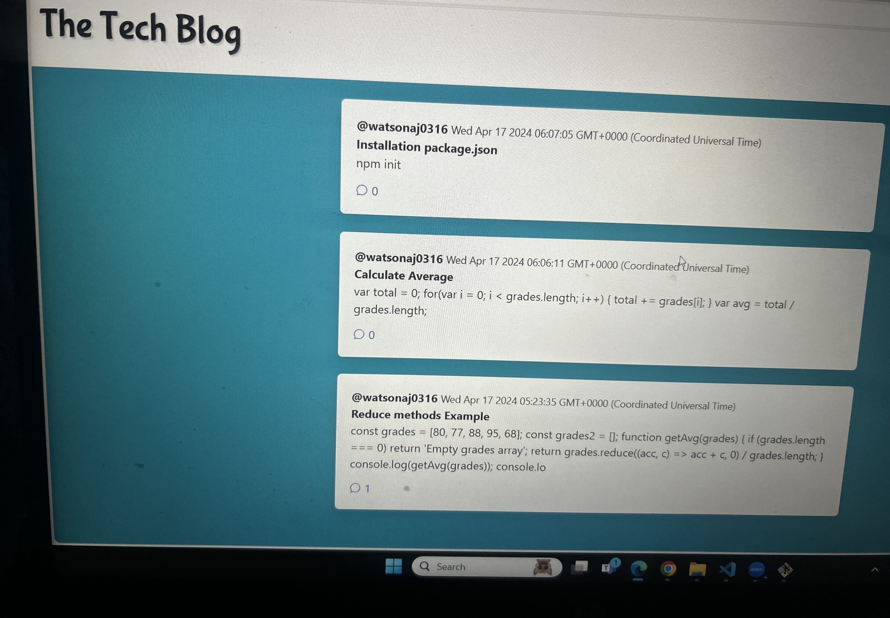

# MVC-challenge

## License
This project is licensed under the ISC license.

## Table of Contents 
- [Description](#description)
- [Packages](#packages)
- [Usage](#usage)
- [Contact](#contact)

## Description
This project is a blog site for tech developers! The motivation for this project was to create a blog where tech people can share their thoughts, opinions, articles, and blog posts. When you get to the site, the homepage presents you with existing blog posts and a navbar to help direct you around the site. You will be noticed to signup or login on the homepage. If you signup for an account to see posts, you will be automatically logged in. 

## Packages
### General Technologies:
- JavaScript
- Node.js
- Git
- Heroku

### NPM Packages:
- nodemon
- express
- dotenv
- mysql2
- sequelize
- bcrypt
- connect-session-sequelize
- express-handlebars
- express-session
 
## Usage 
1. Clone the repository.
2. Install dependencies using `npm install`.
3. Configure your environment variables:
   - DB_NAME=''
   - DB_USER=''
   - DB_PW=''
   - DB_SESSION_SECRET=''
4. Open the "server.js" file in your integrated terminal. 
5. Run the command `npm run seed` (or `node seeds/index.js`) to seed the database if desired.
6. Run the command `npm run start` (or `node server.js`). Alternatively, if you have Nodemon installed, run `npm run watch` (or `nodemon server.js`). 
9. Open 'localhost:3001' in your browser and see the site in action.
10. Enter login/logout/signup requests as you please, create a new blog post, or update/delete an existing one, or add comments to blog posts. 

## Screenshot

## Contact
For any inquiries, please contact:
Email: watsonalyece33@gmail.com
